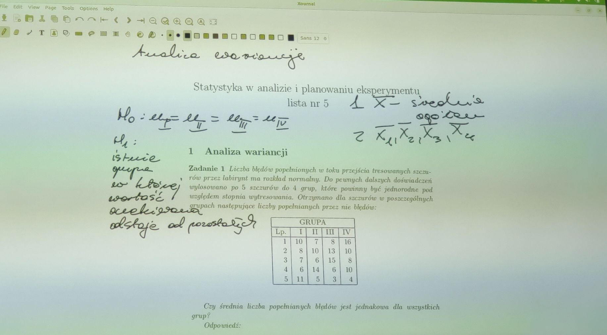
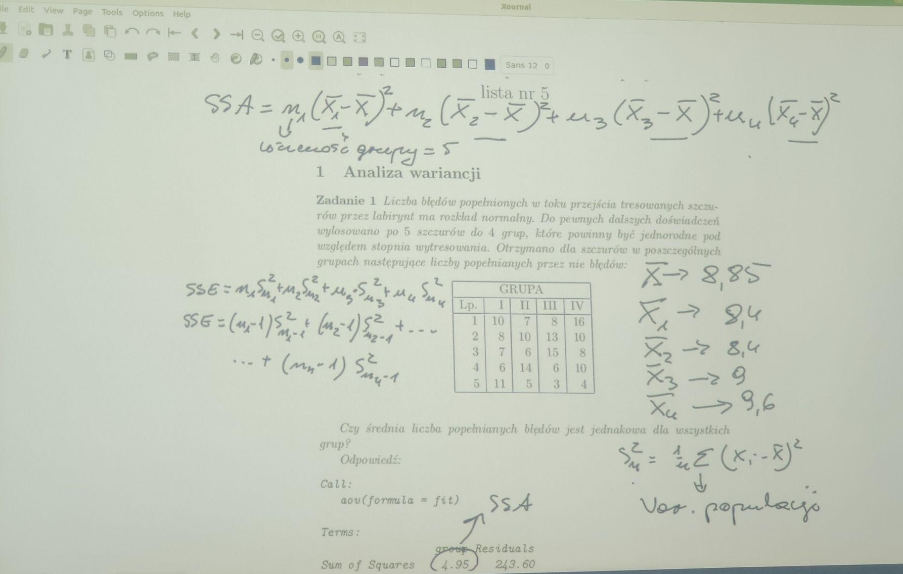
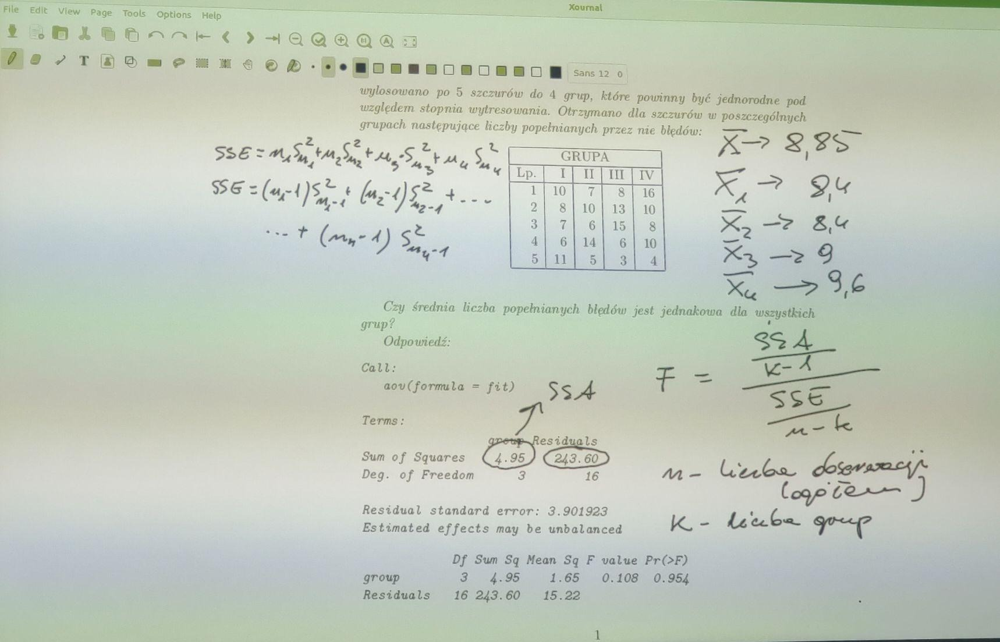
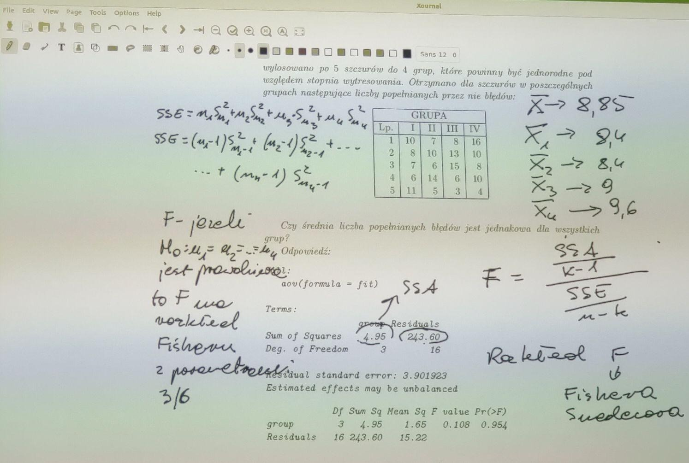
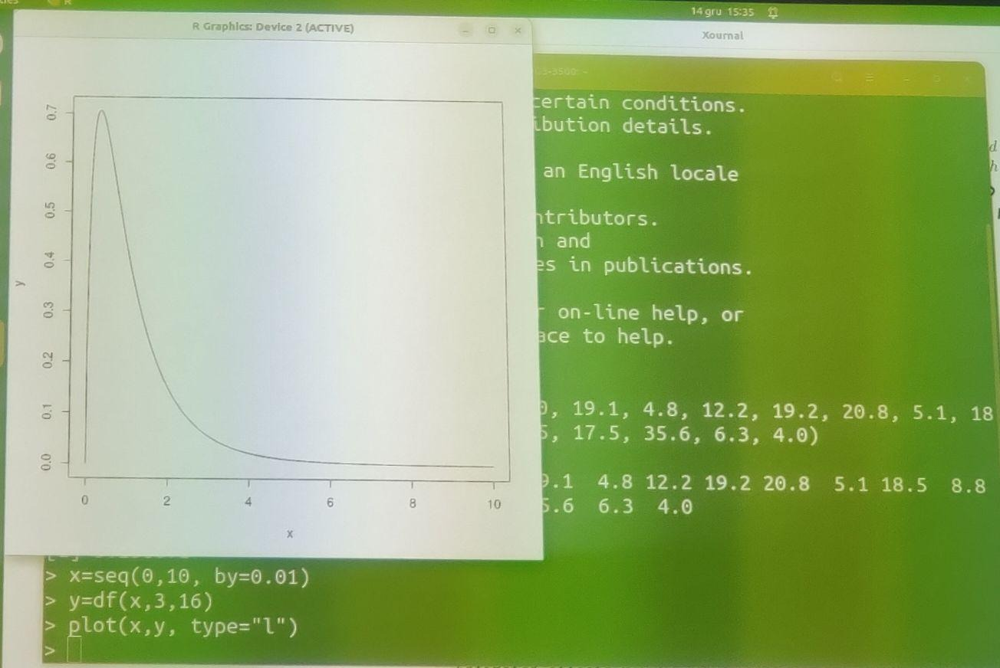

# Analiza Wariancji

### Zadania z pliku [lista5_analiza_wariancji.pdf](lista5_analiza_wariancji.pdf).

# Wyniki skryptow

```console
chmod u+x Run.sh
./Run.sh
```

## Wstęp do zadania










## Zadanie 1
Liczba bledow popelnionych w toku przejscia tresowanych szczurow przez labirynt ma rozklad normalny. Do pewnych dalszych doswiadczen wylosowano po 5 szczurow do 4 grup, ktore powinny byc jednorodne pod wzgledem stopnia wytresowania. Otrzymano dla szczurow w poszczegolnych grupach nastepujace liczby popelnianych przez nie bledow:

### Grupy
| Lp. | I | II | III | IV |
|-----|---|----|-----|----|
| 1   | 10| 7  | 8   | 16 |
| 2   | 8 | 10 | 13  | 10 |
| 3   | 7 | 6  | 15  | 8  |
| 4   | 6 | 14 | 6   | 10 |
| 5   | 11| 5  | 3   | 4  |

Czy srednia liczba popelnianych bledow jest jednakowa dla wszystkich grup?

```R
[1] "Zadanie 1"
[1] 8.85
[1] 8.4 8.4 9.0 9.6
[1] 4.95
[1] 243.6
[1] 0.0004233374
```

## Jak stworzyc wykres?


