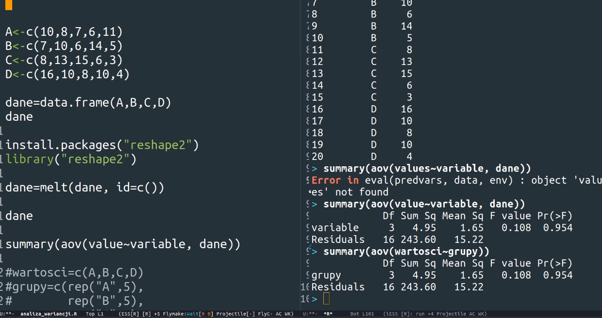
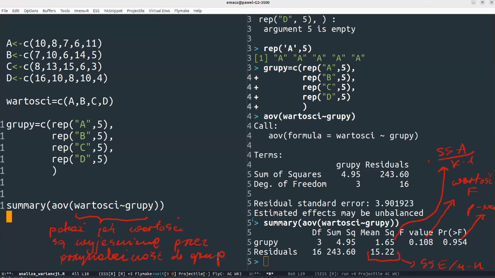
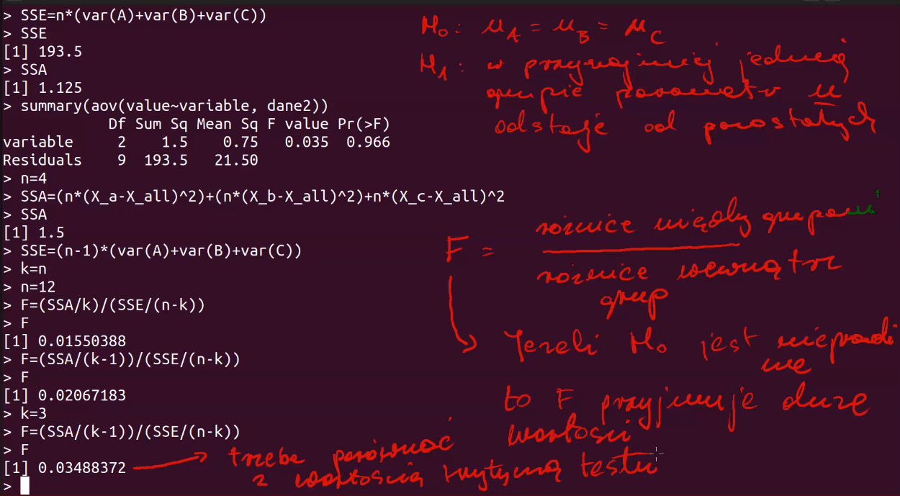
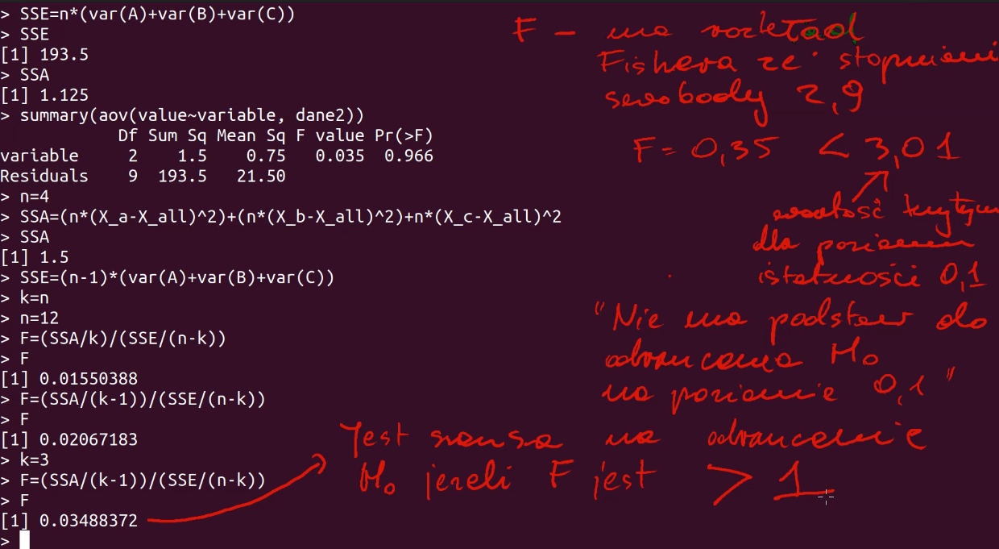
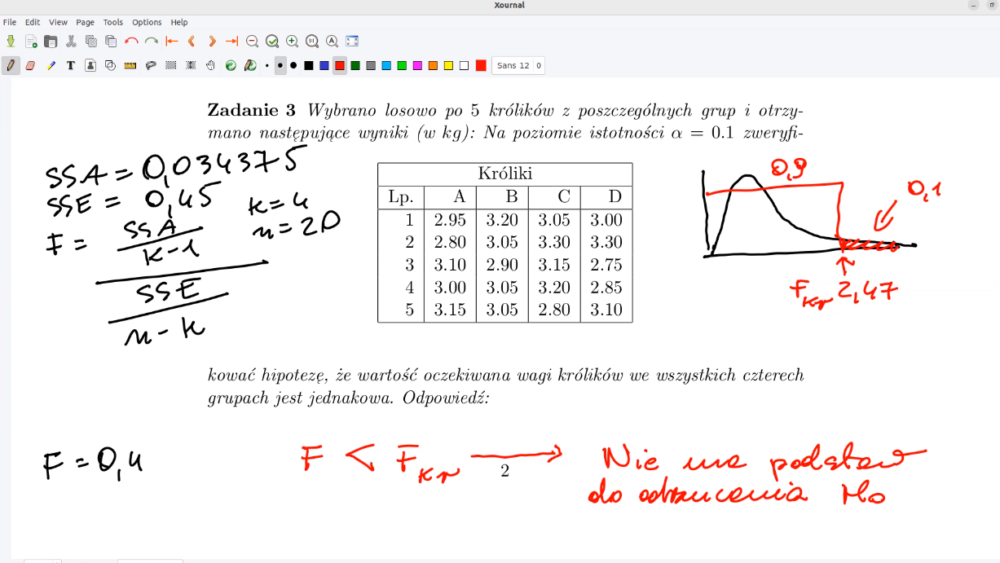
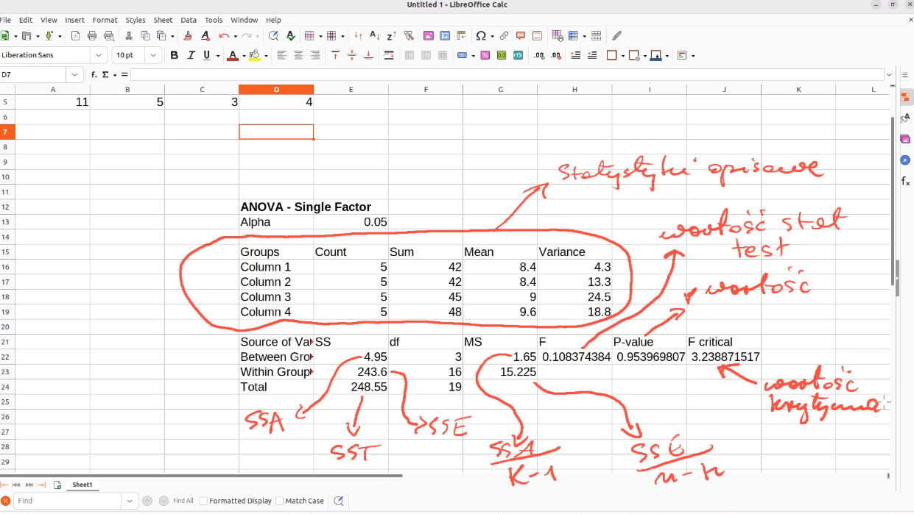

# Analiza Wariancji

### Zadania z pliku [lista5_analiza_wariancji.pdf](lista5_analiza_wariancji.pdf).

# Wyniki skryptow

```console
chmod u+x Run.sh
./Run.sh
```

## Wstęp do zadania


## Zadanie 1
Liczba bledow popelnionych w toku przejscia tresowanych szczurow przez labirynt ma rozklad normalny. Do pewnych dalszych doswiadczen wylosowano po 5 szczurow do 4 grup, ktore powinny byc jednorodne pod wzgledem stopnia wytresowania. Otrzymano dla szczurow w poszczegolnych grupach nastepujace liczby popelnianych przez nie bledow:

### Grupy
| Lp. | I | II | III | IV |
|-----|---|----|-----|----|
| 1   | 10| 7  | 8   | 16 |
| 2   | 8 | 10 | 13  | 10 |
| 3   | 7 | 6  | 15  | 8  |
| 4   | 6 | 14 | 6   | 10 |
| 5   | 11| 5  | 3   | 4  |

Czy srednia liczba popelnianych bledow jest jednakowa dla wszystkich grup?



```R
[1] "Zadanie 1"
[1] 8.85
[1] 8.4 8.4 9.0 9.6
[1] 4.95
[1] 243.6
[1] 0.0004233374
```

```R
[1] "Zadanie 1v2"
            Df Sum Sq Mean Sq F value Pr(>F)
grupy        3   4.95    1.65   0.108  0.954
Residuals   16 243.60   15.22
```

```R
[1] "Zadanie 1v3"
            Df Sum Sq Mean Sq F value Pr(>F)
variable     3   4.95    1.65   0.108  0.954
Residuals   16 243.60   15.22
```

## Zadanie 2
Trzech nauczycieli jezyka polskiego mialo ocenic w skali punktowej 1 − 20 wypracowania wylosowanych czterech uczniow pewnej szkoly. Wyniki byly nastepujace:

### Nauczyciel
| Lp. | A | B | C |
|-----|---|---|---|
| 1   | 19| 17| 20|
| 2   | 20| 20| 19|
| 3   | 10| 11|  9|
| 4   | 14| 15| 12|

Na poziomie istotnosci α = 0.1 zweryfikowac hipokowac hipoteze, ze wartosc oczekiwana wagi krolikow we wszystkich czterech grupach jest jednakowa.







```R
[1] "Zadanie 2"
   A  B  C
1 19 17 20
2 20 20 19
3 10 11  9
4 14 15 12
[1] "SSA = 1.5"
[1] "SSE = 193.5"
[1] "F = 0.0348837209302326"
[1] "wartosc krytyczna = 4.25649472909375"
[1] "Nie ma podstaw, poniewaz F jest mniejsze od wartosci krytycznej
```

```R
[1] "Zadanie 2v2"
Call:
   aov(formula = value ~ variable, data = dane)

Terms:
                variable Residuals
Sum of Squares       1.5     193.5
Deg. of Freedom        2         9

Residual standard error: 4.636809
Estimated effects may be unbalanced
            Df Sum Sq Mean Sq F value Pr(>F)
variable     2    1.5    0.75   0.035  0.966
Residuals    9  193.5   21.50
```

## Zadanie 3
Wybrano losowo po 5 krolikow z poszczegolnych grup i otrzymano nastepuj ace wyniki (w kg):

### Kroliki
| Lp. |  A |  B |  C |  D |
|-----|----|----|----|----|
| 1   |2.95|3.20|3.05|3.00|
| 2   |2.80|3.05|3.30|3.30|
| 3   |3.10|2.90|3.15|2.75|
| 4   |3.00|3.05|3.20|2.85|
| 5   |3.15|3.05|2.80|3.10|

Na poziomie istotnosci α = 0.1 zweryfikowac hipoteze, ze wartosc oczekiwana wagi krolikow we wszystkich czterech grupach jest jednakowa.



```R
[1] "Zadanie 3"
     A    B    C    D
1 2.95 3.20 3.05 3.00
2 2.80 3.05 3.30 3.30
3 3.10 2.90 3.15 2.75
4 3.00 3.05 3.20 2.85
5 3.15 3.05 2.80 3.10
[1] "SSA = 0.034375"
[1] "SSE = 0.45"
[1] "F = 0.407407407407408"
[1] "wartosc krytyczna = 2.46181075324354"
[1] "Nie ma podstaw do odrzcucenia H0 bo F jest mniejsze od wartosci krytycznej"
```

## Zadanie 4
Po zastosowaniu czterech roznych stezen azotu D1, D2, D3, D4 na 20 poletkach doswiadczalnych otrzymano z nich nastepujace ilosci zboz w kilogramach (patrz tabelka)

### Dawki azotu
| Lp. | D1 | D2 | D3 | D4 |
|-----|----|----|----|----|
| 1   | 30 | 40 | 60 | 70 |
| 2   | 40 | 50 | 90 | 50 |
| 3   | 20 | 40 | 80 | 60 |
| 4   | 40 | 60 | 50 | 50 |
| 5   | 20 | 10 |110 | 30 |

Czy zawartosc azotu w glebie ma wplyw na wysokosc plonow?

```R
[1] "Zadanie 4"
   A  B   C  D
1 30 40  60 70
2 40 50  90 50
3 20 40  80 60
4 40 60  50 50
5 20 10 110 30
[1] "SSA = 6440"
[1] "SSE = 4960"
[1] "F = 6.9247311827957"
[1] "wartosc krytyczna = 3.23887151745358"
[1] "Nie ma podstaw do odrzcucenia H0 bo F jest wieksze od wartosci krytycznej"
```

## Zadanie 5
Liczba nasion, ktore nie wykielkowaly w n - elementowej losowej probie wysianych nasion jest zmienn a losow a. Jako suma zmiennych zerojedynkowych zmienna ta ma asymptotyczny rozklad normalny. Badania nad wplywem rodzaju podloza (A,B,C) na sile kielkowania nasion pomidorow na 9 doswiadczalnych poletkach (po trzy poletka przeznaczono na kazdy rodzaj podloza) daly nastepuj ace wyniki dotycz ace liczby wysianych nasion, ktore nie wykielkowaly:

### Podloze
| A | B | C |
|---|---|---|
| 0 | 4 | 1 |
| 3 | 5 | 0 |
| 4 | 1 | 2 |

Czy rodzaj podloza jest czynnikiem roznicuj acym srednia liczbe nasion, ktore nie wykielkowaly? Odpowiednia hipoteze prosze zweryfikowac na poziomie istotnosci 0.05.

```R
[1] "Zadanie 5"
  A B C
1 0 4 1
2 3 5 0
3 4 1 2
[1] "SSA = 8.22222222222222"
[1] "SSE = 19.3333333333333"
[1] "F = 1.27586206896552"
[1] "wartosc krytyczna = 3.46330407009565"
[1] "Nie ma podstaw, poniewaz F jest mniejsze od wartosci krytycznej"
```

## Inne
### Jak stworzyc wykres?


### Excel screenshot (nie wiem do ktorego)

