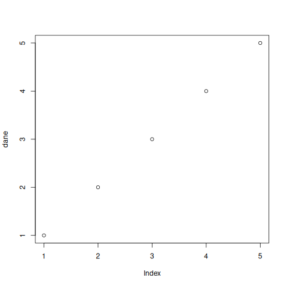

# Examples with ChatGPT

## funkcja()
Zwięzły opis do czego.

```R
# kod R
```
```console
# output
```

## aov()
Używana do wykonywania analizy wariancji, by zbadać różnice między średnimi wartościami kilku grup.

```R
fit <- aov(Sepal.Length ~ Species, data = iris)
summary(fit)
```
```console
             Df Sum Sq Mean Sq F value Pr(>F)
Species       2  63.21  31.606   119.3 <2e-16 ***
Residuals   147  38.96   0.265
---
Signif. codes:  0 ‘***’ 0.001 ‘**’ 0.01 ‘*’ 0.05 ‘.’ 0.1 ‘ ’ 
```

## c()
Łączy wiele wartości w jedną wektorową wartość.

```R
vectors <- c(1, 2, 3, 4)
print(vectors)
```
```console
[1] 1 2 3 4
```

## chisq.test()
Używana do testowania równowagi proporcji w co najmniej dwóch kategorii.

```R
table <- table(iris$Species)
result <- chisq.test(table)
result
```
```console
    Chi-squared test for given probabilities

data:  table
X-squared = 0, df = 2, p-value = 1
```

## cor()
Używana do obliczania korelacji między dwoma zmiennymi.

```R
correlation <- cor(iris$Petal.Length, iris$Sepal.Length)
print(correlation)
```
```console
[1] 0.8717538
```

## data.frame()
Używana do tworzenia obiektu danych w postaci tabeli z wierszami i kolumnami.

```R
data_frame <- data.frame(col1 = c("a", "b", "c"), 
                         col2 = c(1, 2, 3))
print(data_frame)
```
```console
  col1 col2
1    a    1
2    b    2
3    c    3
```

## length()
Zwraca liczbę elementów.

```R
vectors_length <- length(vectors)
print(vectors_length)
```
```console
[1] 4
```

## library()
Importuje biblioteki zawierające funkcje i narzędzia, które można użyć w danym skrypcie.  

```R
library(ggplot2)
```
```console
```

## lm()
Tworzy model liniowy na podstawie danych.

```R
linear_model <- lm(Sepal.Length ~ Petal.Length, data = iris)
summary(linear_model)
```
```console
Call:
lm(formula = Sepal.Length ~ Petal.Length, data = iris)

Residuals:
     Min       1Q   Median       3Q      Max
-1.24675 -0.29657 -0.01515  0.27676  1.00269

Coefficients:
             Estimate Std. Error t value Pr(>|t|)
(Intercept)   4.30660    0.07839   54.94   <2e-16 ***
Petal.Length  0.40892    0.01889   21.65   <2e-16 ***
---
Signif. codes:  0 ‘***’ 0.001 ‘**’ 0.01 ‘*’ 0.05 ‘.’ 0.1 ‘ ’ 1

Residual standard error: 0.4071 on 148 degrees of freedom
Multiple R-squared:   0.76, Adjusted R-squared:  0.7583
F-statistic: 468.6 on 1 and 148 DF,  p-value: < 2.2e-16
```

## max()
Zwraca maksymalną wartość w zbiorze danych.

```R
maximum <- max(c(-10, 0, 10, 42))
print(maximum)
````
```console
[1] 42
```

## mean()
Oblicza średnią z wartości w zbiorze danych.

```R
dane <- c(1,2,3,4,5)
mean(dane)
```
```console
[1] 3
```

## melt()
Przekształca format danych z wide na long

```R
library(reshape2)
dane <- data.frame(id = 1:3, w1 = c(1,2,3), w2 = c(4,5,6))
melt(dane, id = "id")
```
```console
  id variable value
1  1       w1     1
2  2       w1     2
3  3       w1     3
4  1       w2     4
5  2       w2     5
6  3       w2     6
```

## paste()
Łączy ze sobą wartości wejściowe.

```R
imie <- "Jan"
nazwisko <- "Kowalski"
paste(imie, nazwisko, sep = " ")
```
```console
[1] "Jan Kowalski"
```

## plot()
Rysuje wykres z danych.

```R
dane <- c(1,2,3,4,5)
plot(dane)
```


## print()
Wypisuje wartości na ekran.

```R
x <- c(1,2,3)
print(x)
```
```console
[1] 1 2 3
```

## qf()
Oblicza kwantyl rzędu f z zbioru danych.

```R
qf(0.95, df1 = 5, df2 = 10)
```
```console
[1] 3.325835
```

## qnorm()
Oblicza kwantyl normalny dla podanej wartości p i parametrów.

```R
qnorm(0.975, mean = 0, sd = 1)
```
```console
[1] 1.959964
```

## qt()
Oblicza kwantyl t-Studenta dla podanej liczby stopni swobody i wartości p.

```R
qt(0.975, df = 30)
```
```console
[1] 2.042272
```

## rbind()
Łączy dwa lub więcej zbiorów danych w jeden wiersz po wierszu.

```R 
dane1 <- data.frame(col1 = c(1,2,3), col2 = c(4,5,6))
dane2 <- data.frame(col1 = c(7,8,9), col2 = c(10,11,12))
rbind(dane1, dane2)
```
```console
rbind(dane1, dane2)
  col1 col2
1    1    4
2    2    5
3    3    6
4    7   10
5    8   11
6    9   12
```

## rep()
Powtarza wartość wejściową określoną liczbę razy

```R
rep(6, 3)
```
```console
[1] 6 6 6
```

## rnorm()
Generuje losowe liczby z rozkładu normalnego.

```R 
rnorm(10, mean = 0, sd = 1)
```
```console
 [1]  2.39459723 -2.83515420  0.78707600  0.34906728 -0.92774238 -0.07411789
 [7] -0.14701004 -0.13538480  0.47155436  0.15444597
```

## runif()
Generuje losowe liczby z rozkładu jednostajnego.
```R 
runif(10, min = 0, max = 1)
```
```console
 [1] 0.06829708 0.28603541 0.62966302 0.81165102 0.42138388 0.97779886
 [7] 0.51877079 0.95379336 0.72728560 0.18316756
```

## sample()
Losowo wybiera określoną liczbę elementów z zadanego zbioru.
```R
sample(1:10, 10, replace = TRUE)
```
```console
[1]  2  8  4  6  1 10  7  3  4 10
```

## sd()
Oblicza odchylenie standardowe dla danych wejściowych.
```R 
x <- c(1, 2, 3, 4, 5)
sd(x)
```
```console
[1] 1.581139
```

## seq()
Generuje sekwencję liczb.

```R
seq(from = 1, to = 10, by = 1)
```
```console
 [1]  1  2  3  4  5  6  7  8  9 10
```

## sprintf()
Formatuje text do określonego formatu.

```R
sprintf("Liczba pi wynosi %.2f", pi)
````
```console
[1] "Liczba pi wynosi 3.14"
```

## sqrt()
Oblicza pierwiastek kwadratowy.

```R
sqrt(9)
```
```console
[1] 3
```

## summary()
Generuje skrócony raport ze statystyk opisowych dla wejściowych danych.

```R
dane <- rnorm(10)
summary(dane)
```
```console
   Min. 1st Qu.  Median    Mean 3rd Qu.    Max.
-2.3964 -0.6271 -0.0629 -0.2826  0.1688  0.8283
```

## table()
Generuje tabelę częstości.

```R
literki <- c("A", "B", "C")
tabela <- table(sample(literki, 10, replace=TRUE))
print(tabela)
```

## t.test()
Test t-Studenta.

```R
dane <- rnorm(10)
t.test(dane)
```
```console
    One Sample t-test

data:  dane
t = -0.25062, df = 9, p-value = 0.8077
alternative hypothesis: true mean is not equal to 0
95 percent confidence interval:
 -1.0696122  0.8562513
sample estimates:
 mean of x
-0.1066804
```

## var()
Liczy wariancję danych.

```R
dane <- rnorm(10)
var(dane)
```
```console
[1] 0.9455764
```
