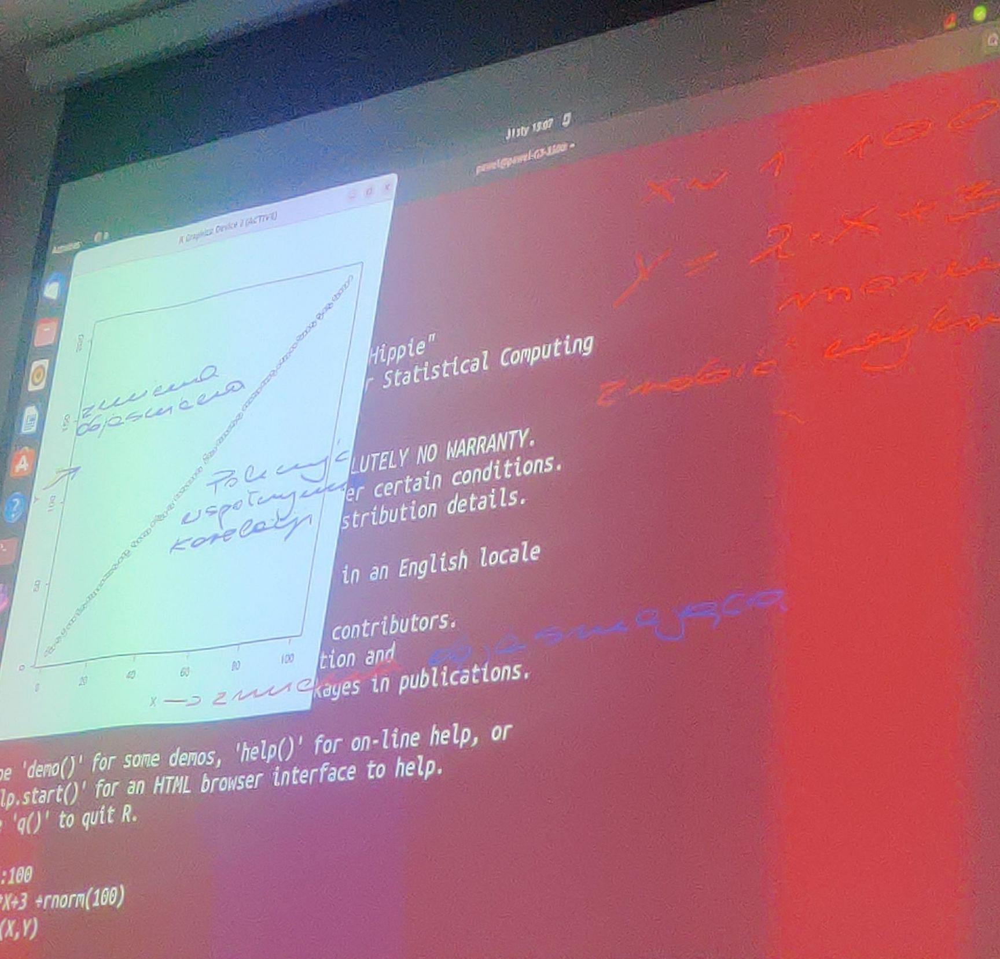
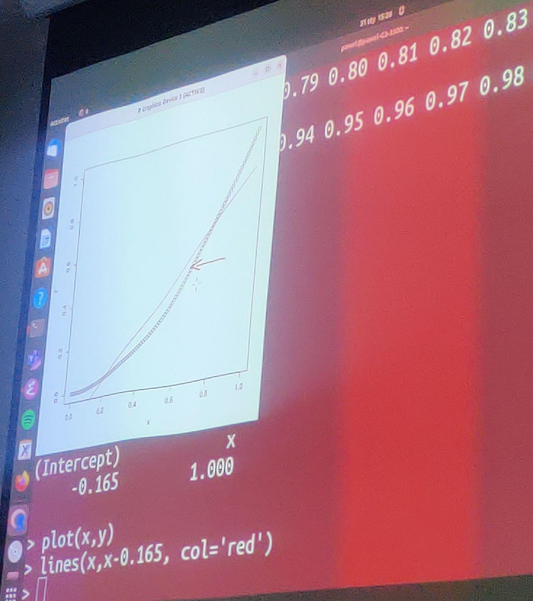
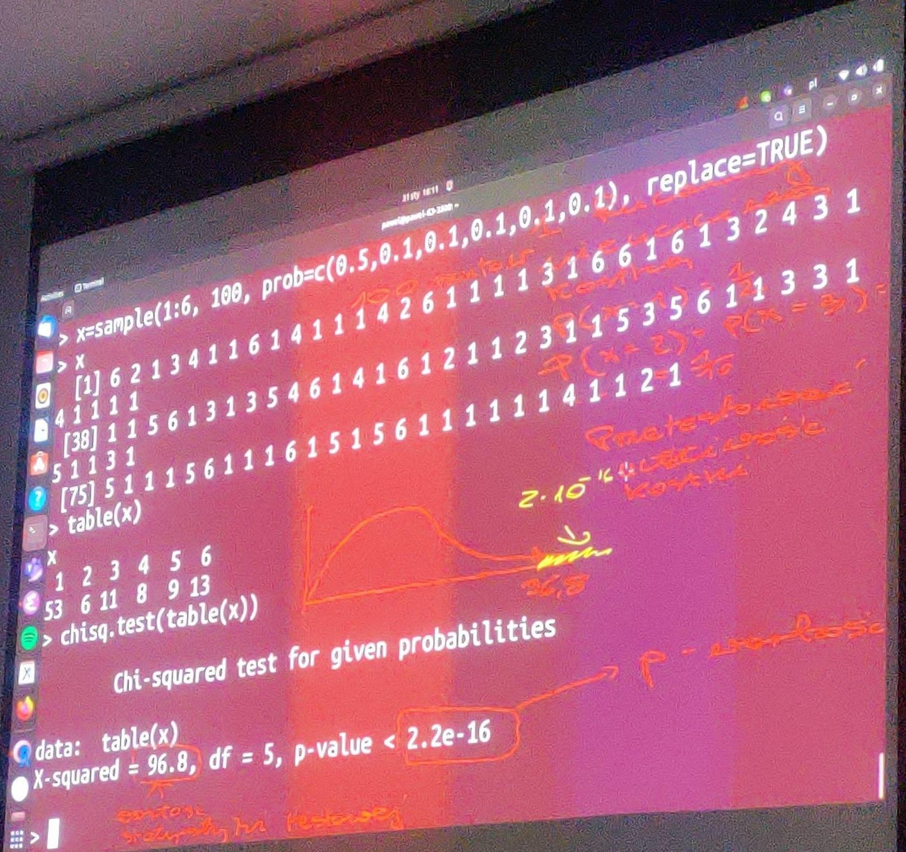

# Regresja liniowa

### Zadania wymyslane byly przez prowadzacego zajecia.

# Wyniki skryptow

```console
chmod u+x Run.sh
./Run.sh
```

## Zadanie 1
Pokazanie ze regresje liniowa sie uzywa do funkcji liniowych.



```R
[1] "Zadanie 1"
[1] 0.9998992

Call:
lm(formula = y ~ x)

Residuals:
     Min       1Q   Median       3Q      Max
-2.25671 -0.51762 -0.00652  0.60594  1.72338

Coefficients:
            Estimate Std. Error t value Pr(>|t|)
(Intercept) 3.122067   0.166628   18.74   <2e-16 ***
x           1.997429   0.002865  697.28   <2e-16 ***
---
Signif. codes:  0 ‘***’ 0.001 ‘**’ 0.01 ‘*’ 0.05 ‘.’ 0.1 ‘ ’ 1

Residual standard error: 0.8269 on 98 degrees of freedom
Multiple R-squared:  0.9998,	Adjusted R-squared:  0.9998
F-statistic: 4.862e+05 on 1 and 98 DF,  p-value: < 2.2e-16
```

## Zadanie 2
Pokazanie ze regresje liniowa sie uzywa do funkcji liniowych, lecz tutaj liczby nas zwodza bo to jest funkcja kwadratowa, ktora tworzy parabolke. (Sprawdz najpierw wykres czy jest liniowa, potem dopiero wyniki)




```R
[1] "Zadanie 2"
[1] 0.9676503

Call:
lm(formula = y ~ x)

Residuals:
    Min      1Q  Median      3Q     Max
-0.0850 -0.0681 -0.0225  0.0594  0.1650

Coefficients:
            Estimate Std. Error t value Pr(>|t|)
(Intercept) -0.16500    0.01517  -10.88   <2e-16 ***
x            1.00000    0.02620   38.16   <2e-16 ***
---
Signif. codes:  0 ‘***’ 0.001 ‘**’ 0.01 ‘*’ 0.05 ‘.’ 0.1 ‘ ’ 1

Residual standard error: 0.07678 on 99 degrees of freedom
Multiple R-squared:  0.9363,	Adjusted R-squared:  0.9357
F-statistic:  1456 on 1 and 99 DF,  p-value: < 2.2e-16
```

## Zadanie 3
Uzycie regresji liniowej dla 100 liczb od 0 do 100 z powtorzeniami, z y = 3x + 5 + `rnorm(100, 0, 5)`.



```R
[1] 0.9981703

Call:
lm(formula = y ~ x)

Residuals:
    Min      1Q  Median      3Q     Max
-15.378  -3.954   0.605   3.536  15.501

Coefficients:
            Estimate Std. Error t value Pr(>|t|)
(Intercept)   4.9004     1.0636   4.607 1.23e-05 ***
x             3.0066     0.0184 163.423  < 2e-16 ***
---
Signif. codes:  0 ‘***’ 0.001 ‘**’ 0.01 ‘*’ 0.05 ‘.’ 0.1 ‘ ’ 1

Residual standard error: 5.297 on 98 degrees of freedom
Multiple R-squared:  0.9963,	Adjusted R-squared:  0.9963
F-statistic: 2.671e+04 on 1 and 98 DF,  p-value: < 2.2e-16
```

## Zadanie 4
Przetestowanie czy 100 rzutow koscia byl uczciwy (50% na 1, reszta 10%).

```R
[1] "Zadanie 4"
not_fair
 1  2  3  4  5  6
46 13 17  8  7  9

	Chi-squared test for given probabilities

data:  observed
X-squared = 66.08, df = 5, p-value = 6.69e-13
```

Hipoteza zerowa to ze jest uczciwa (tak jest domyslnie skonfigurowany chisq.test) i mozemy ja odrzucic z bledem wynoszacym `p-value`.
