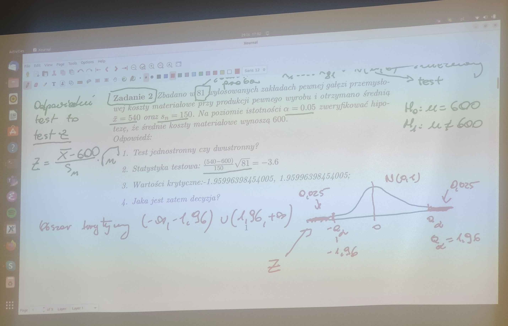

### Zadania z pliku PDF [testowanie_hipotez](testowanie_hipotez.pdf).

# Wyniki skryptow

```console
chmod u+x Run.sh
./Run.sh
```

## Zadanie 1
W pewnym eksperymencie psychiatrycznym przeprowadzonym na grupie 42 chorych otrzymano nastepujace wyniki: (w %) 34.8, 33.9, 32.6, 49.4, 44.9, 55.2, 48.5, 40.3, 34.0, 42.1, 17.9, 36.0, 21.2, 35.9, 41.2, 40.9, 16.9, 42.9, 28.7, 51.9, 24.1, 29.1, 44.6, 41. 2, 17.0, 29.8, 35.0, 51.7, 42.9, 54.2, 25.9, 30.3, 36.9, 19.2, 59.1, 31.3, 50.0, 19.8, 30.6, 31.7, 28.8, 30.0. Czy na podstawie tych danych mozna twierdzic, ze sredni wynik jest rowny 50?


```R
[1] "Zadanie 1"
[1] 36.00952

	One Sample t-test

data:  x
t = -8.1614, df = 41, p-value = 3.983e-10
alternative hypothesis: true mean is not equal to 50
95 percent confidence interval:
 32.54759 39.47146
sample estimates:
mean of x 
 36.00952
```

## Zadanie 2
Zbadano w 81 wylosowanych zakladach pewnej galezi przemyslowej koszty materialowe przy produkcji pewnego wyrobu i otrzymano srednia x = 540 oraz sn = 150. Na poziomie istotnosci α = 0.05 zweryfikowac hipoteze, ze srednie koszty materialowe wynosza 600. 


## Zadanie 3
Wiadomo, ze rozklad wynikow pomiarow glebokosci morza w pewnym rejonie jest normalny z odchyleniem standardowym Sn−1 = 5 m. Dokonano 5 niezaleznych pomiarow i otrzymano wyniki (w m): 862, 870, 876, 866, 871. Na poziomie istotnosci α = 0.05 zweryfikowac hipoteze, ze srednia glebokosc morza w tym rejonie jest rowna 870 m. 



```R
[1] "Zadanie 3 (idk)"
[1] -0.4472136

	One Sample t-test

data:  x
t = -0.42258, df = 4, p-value = 0.6943
alternative hypothesis: true mean is not equal to 870
95 percent confidence interval:
 862.4297 875.5703
sample estimates:
mean of x 
      869 
```

## Zadanie 4
Automat produkuje okreslonych wymiarow blaszki o nominalnej grubosci 0.04 mm. Wylosowana proba 25 blaszek dala srednia grubosc x = 0.037 mm oraz sn−1 = 0.05 mm. Czy mozna zatem twierdzic, ze produkowane blaszki sa ciensze niz 0.04 mm ? Przyjac poziom ufnosci α = 0.01. 


```R
[1] "Zadanie 4 (idk)"
[1] -0.3
```

## Zadanie 5
Wylosowano niezaleznie 10 indywidualnych gospodarstw rolnych w pewnej wsi i otrzymano dla nich nastepujace wielkosci uzyskanych plonow owsa (w q/ha); 18.1, 17.0, 17.5, 17.8, 18.3, 16.7, 18.0, 15.9, 17.6, 18.1. Na poziomie istotnosci α = 0.10 zweryfikowac hipoteze, ze sredni plon owsa w tej wsi wynosi 18q/ha. 


```R
[1] "Zadanie 5"

	One Sample t-test

data:  x
t = -2.0882, df = 9, p-value = 0.06638
alternative hypothesis: true mean is not equal to 18
95 percent confidence interval:
 16.95834 18.04166
sample estimates:
mean of x 
     17.5 
```

## Zadanie 6
Zadanie 6 Dokonano 22 niezaleznych pomiarow strat z osypania sie ziarna zyta w wylosowanych gospodarstwach rolnych w 1966 roku i otrzymano nastepujace straty (%) 6.05, 5.89, 5.82, 6.31, 5.26, 5.81, 6.40, 5.92, 6.12, 6.03, 5.47, 5.64, 6.06, 5.87, 5.69, 5.88, 5.49, 5.87, 5.83, 5.75, 5.97, 5.79. Przyjmujac poziom istotnosci α = 0.01 zweryfikowac hipoteze, ze sredni procent strat z osypania sie ziarna zyta wynosi 5.5. 

```R
[1] "Zadanie 6"

	One Sample t-test

data:  x
t = 6.4658, df = 21, p-value = 2.086e-06
alternative hypothesis: true mean is not equal to 5.5
95 percent confidence interval:
 5.744212 5.975788
sample estimates:
mean of x 
     5.86 
```
