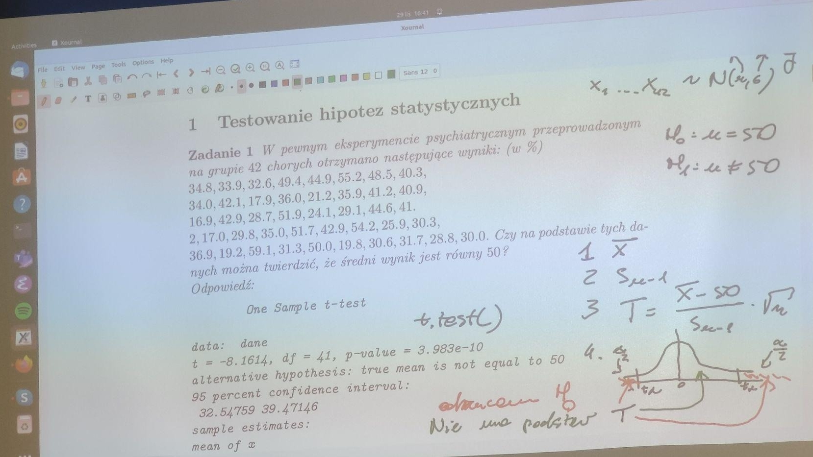
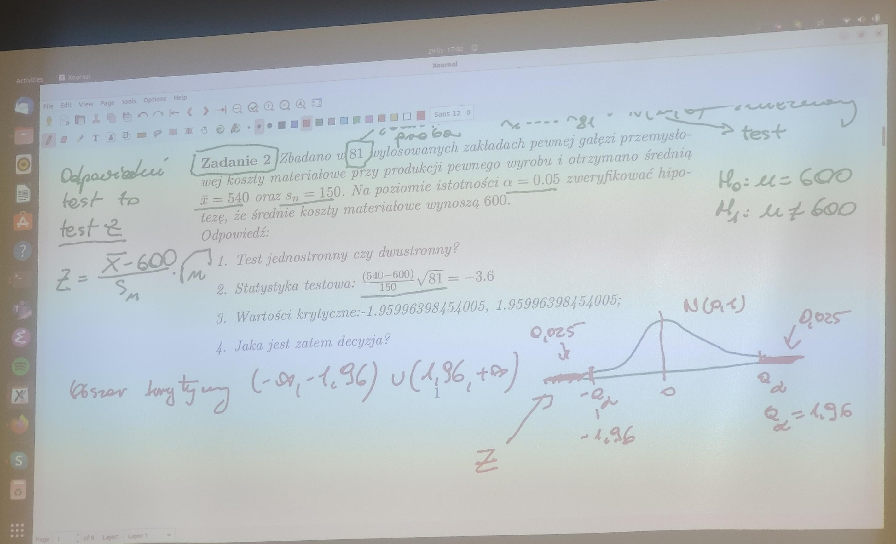
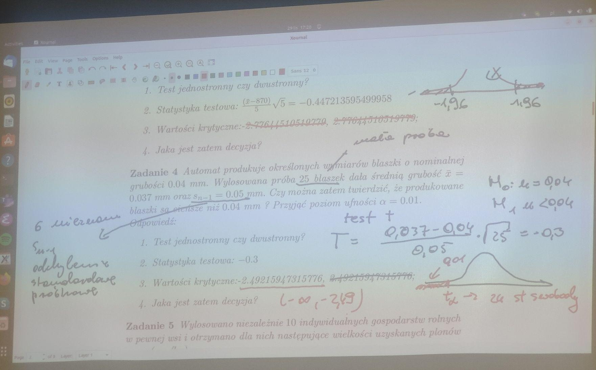
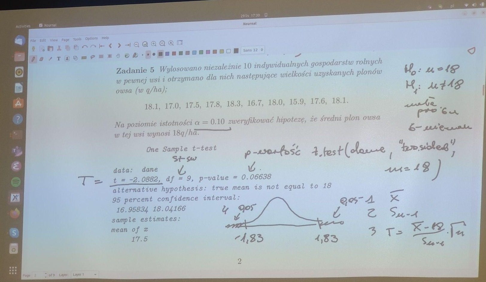
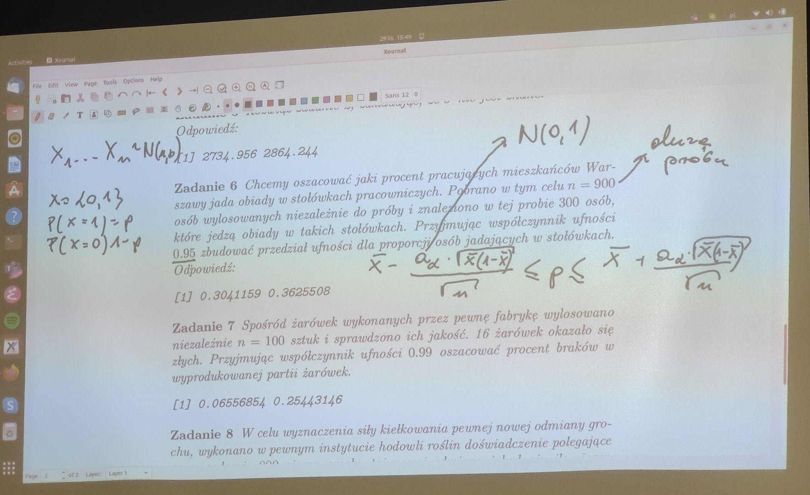
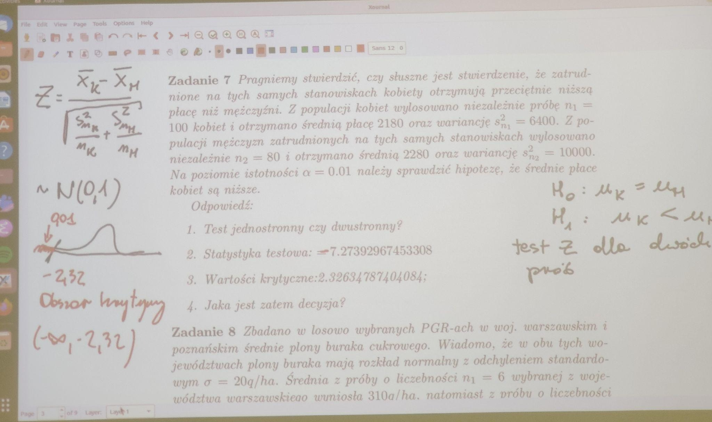

### Zadania z pliku PDF [testowanie_hipotez](testowanie_hipotez.pdf).

# Wyniki skryptow

```console
chmod u+x Run.sh
./Run.sh
```

## Zadanie 1
W pewnym eksperymencie psychiatrycznym przeprowadzonym na grupie 42 chorych otrzymano nastepujace wyniki: (w %) 34.8, 33.9, 32.6, 49.4, 44.9, 55.2, 48.5, 40.3, 34.0, 42.1, 17.9, 36.0, 21.2, 35.9, 41.2, 40.9, 16.9, 42.9, 28.7, 51.9, 24.1, 29.1, 44.6, 41. 2, 17.0, 29.8, 35.0, 51.7, 42.9, 54.2, 25.9, 30.3, 36.9, 19.2, 59.1, 31.3, 50.0, 19.8, 30.6, 31.7, 28.8, 30.0. Czy na podstawie tych danych mozna twierdzic, ze sredni wynik jest rowny 50?



```R
[1] "Zadanie 1"
[1] 36.00952

	One Sample t-test

data:  x
t = -8.1614, df = 41, p-value = 3.983e-10
alternative hypothesis: true mean is not equal to 50
95 percent confidence interval:
 32.54759 39.47146
sample estimates:
mean of x 
 36.00952
```

## Zadanie 2
Zbadano w 81 wylosowanych zakladach pewnej galezi przemyslowej koszty materialowe przy produkcji pewnego wyrobu i otrzymano srednia x = 540 oraz sn = 150. Na poziomie istotnosci α = 0.05 zweryfikowac hipoteze, ze srednie koszty materialowe wynosza 600. 



## Zadanie 3
Wiadomo, ze rozklad wynikow pomiarow glebokosci morza w pewnym rejonie jest normalny z odchyleniem standardowym Sn−1 = 5 m. Dokonano 5 niezaleznych pomiarow i otrzymano wyniki (w m): 862, 870, 876, 866, 871. Na poziomie istotnosci α = 0.05 zweryfikowac hipoteze, ze srednia glebokosc morza w tym rejonie jest rowna 870 m. 

```R
[1] "Zadanie 3 (idk)"
[1] -0.4472136

	One Sample t-test

data:  x
t = -0.42258, df = 4, p-value = 0.6943
alternative hypothesis: true mean is not equal to 870
95 percent confidence interval:
 862.4297 875.5703
sample estimates:
mean of x 
      869 
```

## Zadanie 4
Automat produkuje okreslonych wymiarow blaszki o nominalnej grubosci 0.04 mm. Wylosowana proba 25 blaszek dala srednia grubosc x = 0.037 mm oraz sn−1 = 0.05 mm. Czy mozna zatem twierdzic, ze produkowane blaszki sa ciensze niz 0.04 mm ? Przyjac poziom ufnosci α = 0.01. 



```R
[1] "Zadanie 4 (idk)"
[1] -0.3
```

## Zadanie 5
Wylosowano niezaleznie 10 indywidualnych gospodarstw rolnych w pewnej wsi i otrzymano dla nich nastepujace wielkosci uzyskanych plonow owsa (w q/ha); 18.1, 17.0, 17.5, 17.8, 18.3, 16.7, 18.0, 15.9, 17.6, 18.1. Na poziomie istotnosci α = 0.10 zweryfikowac hipoteze, ze sredni plon owsa w tej wsi wynosi 18q/ha. 



```R
[1] "Zadanie 5"

	One Sample t-test

data:  x
t = -2.0882, df = 9, p-value = 0.06638
alternative hypothesis: true mean is not equal to 18
95 percent confidence interval:
 16.95834 18.04166
sample estimates:
mean of x 
     17.5 
```

## Zadanie 6
Dokonano 22 niezaleznych pomiarow strat z osypania sie ziarna zyta w wylosowanych gospodarstwach rolnych w 1966 roku i otrzymano nastepujace straty (%) 6.05, 5.89, 5.82, 6.31, 5.26, 5.81, 6.40, 5.92, 6.12, 6.03, 5.47, 5.64, 6.06, 5.87, 5.69, 5.88, 5.49, 5.87, 5.83, 5.75, 5.97, 5.79. Przyjmujac poziom istotnosci α = 0.01 zweryfikowac hipoteze, ze sredni procent strat z osypania sie ziarna zyta wynosi 5.5. 



```R
[1] "Zadanie 6"

	One Sample t-test

data:  x
t = 6.4658, df = 21, p-value = 2.086e-06
alternative hypothesis: true mean is not equal to 5.5
95 percent confidence interval:
 5.744212 5.975788
sample estimates:
mean of x 
     5.86 
```

## Zadanie 7
Pragniemy stwierdzic, czy sluszne jest stwierdzenie, ze zatrudnione na tych samych stanowiskach kobiety otrzymuj a przecietnie nizsz a place niz mezczyzni. Z populacji kobiet wylosowano niezaleznie probe n1 = 100 kobiet i otrzymano sredni a place 2180 oraz wariancje s2 n1 = 6400. Z populacji mezczyzn zatrudnionych na tych samych stanowiskach wylosowano niezaleznie n2 = 80 i otrzymano sredni a 2280 oraz wariancje s2 n2 = 10000. Na poziomie istotnosci α = 0.01 nalezy sprawdzic hipoteze, ze srednie place.



```R
[1] "Zadanie 7"
[1] -7.27393
```

## Zadanie 8
Zbadano w losowo wybranych PGR-ach w woj. warszawskim i poznanskim srednie plony buraka cukrowego. Wiadomo, ze w obu tych wojewodztwach plony buraka maj a rozklad normalny z odchyleniem standardowym σ = 20q/ha. Srednia z proby o liczebnosci n1 = 6 wybranej z wojewodztwa warszawskiego wyniosla 310q/ha, natomiast z proby o liczebnosci n2 = 10 wylosowanej z woj. poznanskiego wyniosla 318q/ha. Przyjmujac poziom istotnosci α = 0.1 sprawdzic hipoteze, ze srednie plony buraka cukrowego uzyskane przez PGR-y obu wojewodztw sa jednakowe. 

```R
[1] "Zadanie 8"
[1] -1.6448536 -0.7745967  1.6448536
```

## Zadanie 9
W tescie badajacym pamiec uczniow, dla 8 wylosowanych uczniow otrzymano nastepuj ace liczby zapamietanych przez nich elementow: 16, 13, 14, 21, 19, 18, 26, 17. Natomiast po specjalnym treningu pamieci grupa ta wykazala nastepuj ace wyniki: 21, 17, 20, 26, 23, 22, 21, 18. Przyjmujac poziom istotnosci α = 0.05 zweryfikowac hipoteze, ze trening zwieksza liczbe zapamietanych przez uczniow elementow. 

```R
[1] "Zadanie 9"

     Paired t-test

data:  x and y
t = -2.3932, df = 7, p-value = 0.04794
alternative hypothesis: true mean difference is not equal to 0
95 percent confidence interval:
 -5.96421337 -0.03578663
sample estimates:
mean difference
             -3
```
## Zadanie 10
Zmierzono czas reakcji na pewien u 8 kierowcow badanych w pracowni psychotechnicznej przed i w 15 minut po wypiciu 100g wodki. Wyniki przed wypiciem wodki byly nastepujace (w sekundach): 0.22, 0.18, 0.16, 0.19, 0.20, 0.23, 0.17  a po wypiciu wodki: 0.28, 0.20, 0.3, 0.19, 0.26, 0.28, 0.24. Na poziomie istotnosci α = 0.05 zweryfikowac hipoteze, ze wodka zwieksza czas reakcji na bodziec. 
```R
[1] "Zadanie 10"

     Paired t-test

data:  x and y
t = -3.4174, df = 6, p-value = 0.007094
alternative hypothesis: true mean difference is less than 0
95 percent confidence interval:
        -Inf -0.02465094
sample estimates:
mean difference
    -0.05714286
```

## Zadanie 11
Badajac odruchy warunkowe u psa otrzymano nastepujace ilosci sliny wydzielajacej sie przy pierwszym bodzcu (w cm3): 0.76, 0.54, 0.65, 0.4, 0.27, 0.65, 0.16; natomiast przy drugim bodzcu otrzymano: 0.4, 0.2, 0.09, 0.38, 0.5, 0.15, 0.28 Na poziomie istotnosci α = 0.05 zweryfikowac hipoteze, ze przy drugim bodzcu przecietna ilosc wydzielanej sliny jest mniejsza.

```R
[1] "Zadanie 11"

     Paired t-test

data:  y and x
t = -1.7319, df = 6, p-value = 0.933
alternative hypothesis: true mean difference is greater than 0
95 percent confidence interval:
 -0.4334954        Inf
sample estimates:
mean difference
     -0.2042857
```

## Zadanie 12
W szpitalu wylosowano probie 16 pacjentow chorych na chorobie A oraz probie 26 pacjentow chorych na chorobie B i dokonano pomiarow czasu snu tych pacjentow. Dla pacjentow chorych na chorobie A otrzynano nastepujace wyniki (czas snu w minutach): 438, 154, 374, 250, 305, 299, 434, 432, 453, 445, 466, 413, 551, 342, 123, 508  a dla pacjentow chorych na chorobie B otrzymano 416 454, 400, 315, 373, 370, 203, 505, 372, 249, 285, 339, 439, 262, 372, 149, 275, 452, 320, 460, 392, 272, 263, 379, 309, 358. Na poziomie istotnosci α = 0.05 zweryfikowac hipoteze o jednakowych srednich czasach snu w obu grupach pacjentow.

```R
[1] "Zadanie 12"
[1] 16
[1] 26

     Welch Two Sample t-test

data:  x and y
t = 0.82876, df = 24.29, p-value = 0.4153
alternative hypothesis: true difference in means is not equal to 0
95 percent confidence interval:
 -42.7094 100.0844
sample estimates:
mean of x mean of y
 374.1875  345.5000
```

## Zadanie 13
Zmierzono w dwoch ulach srednicie komorek plastra zbudowanego przez pszczoly. Dla 7 wylosowanych komorek z pierwszego ula otrzymano nastepujace wyniki: 5.36, 5.20, 5.28, 5.16, 5.30, 5.08, 5.23 analogicznie dla drugiego ula otrzymano: 5.15, 5.04, 5.30, 5.22, 5.19, 5.24, 5.12; Na poziomie istotnosci α = 0.05 zweryfikowac hipoteze, ze srednie dlugosci komorek w plastrach pochodzacych z dwoch roznych uli sa rowne.

```R
[1] "Zadanie 13"

     Welch Two Sample t-test

data:  x and y
t = 1.0437, df = 11.901, p-value = 0.3174
alternative hypothesis: true difference in means is not equal to 0
95 percent confidence interval:
 -0.05448052  0.15448052
sample estimates:
mean of x mean of y
     5.23      5.18

[1] -1.959964
[1] 1.959964
```

## Zadanie 14
Zbadano ilosc pior sterowek w dwu grupach golebi pochodzacych od hodowcow slaskich oraz mazowieckich. Dla 8 golebi hodowanych na Slasku otrzymano nastepujace wyniki (liczba pior): 42, 31, 30, 14, 38, 25, 17, 35 natomiast dla 10 golebi hodowcow mazowieckich otrzymano 40, 32, 38, 36, 43, 39, 24, 28, 36, 34. Przyjmujac poziom istotnosci α = 0.1 zweryfikowac hipoteze o roznych gatunkach golebi (charakteryzujacych sie rozna liczba sterowek) hodowanych na Slasku i Mazowszu.

```R
[1] "Zadanie 14"

     Welch Two Sample t-test

data:  x and y
t = -1.5309, df = 10.715, p-value = 0.1548
alternative hypothesis: true difference in means is not equal to 0
95 percent confidence interval:
 -14.6542   2.6542
sample estimates:
mean of x mean of y
       29        35

[1] -1.644854
[1] 1.644854
```