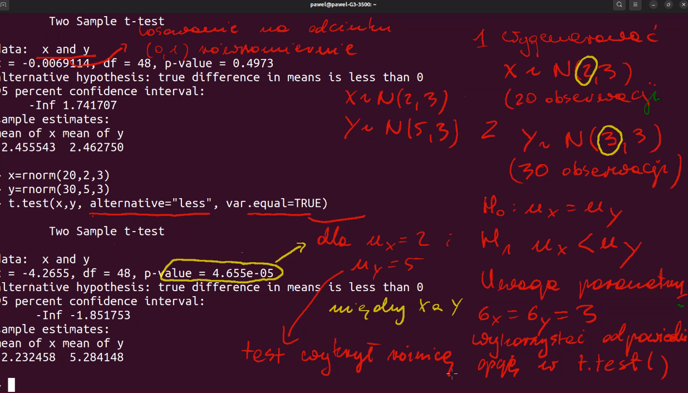
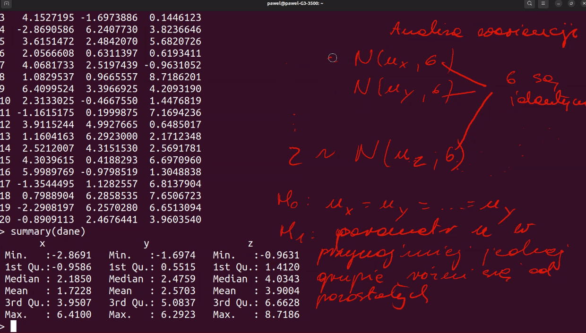
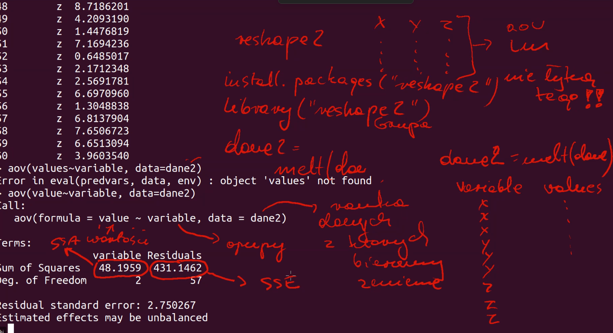
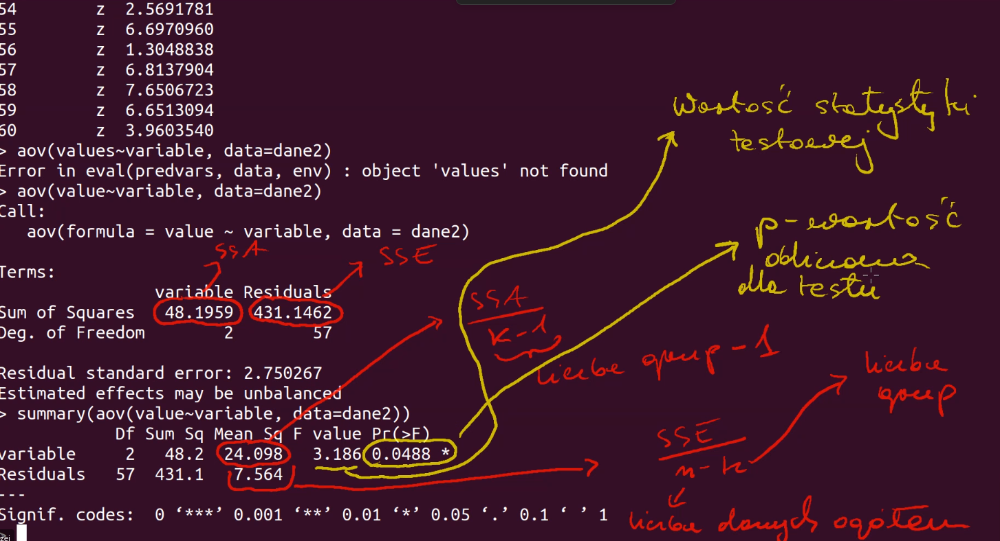
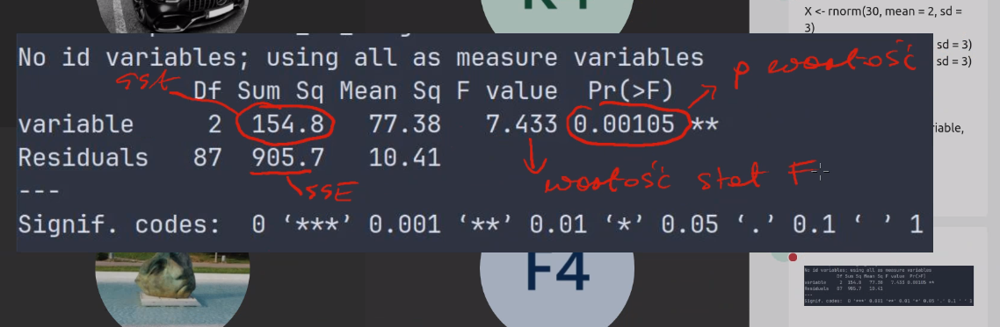

# Zabawa probami

### Zadania wymyslane byly przez prowadzacego zajecia. 
Natomiast ChatGPT zaanalizowal kod R i stworzyl wymyslone polecenia do zadan.

# Wyniki skryptow

```console
chmod u+x Run.sh
./Run.sh
```

## Zadanie 1
Utwórz dwa wektory numeryczne proba_X i proba_Y i przeprowadź test t-Studenta dla nich. Wektor proba_X powinien zawierać 20 losowych wartości z rozkładu normalnego z średnią 2 i odchyleniem standardowym 3, a wektor proba_Y powinien być wektorem proba_X powiększonym o 20 losowych wartości z rozkładu jednostajnego z zakresu od 0 do 1.

```R
[1] "Zadanie 1"
[1] "proba_X"
 [1]  1.9770518 -0.5279796  7.2403742  0.9006896 -2.6072958  6.7562916
 [7]  2.7568741  2.0932059  2.0092950  6.2261979  1.8193805  0.1982914
[13]  6.1968673  3.7235693  6.6881510  1.5594231  2.3687564  1.1145666
[19] -0.1903106 -3.4469844
[1] "proba_Y"
 [1]  2.69232691 -0.07902413  7.42251880  1.12065119 -2.43239951  6.88062046
 [7]  3.63090953  2.94400086  2.22105887  7.16267199  2.18000983  0.48396764
[13]  6.60269915  3.97843970  7.50904236  2.05853868  2.53047979  1.58366482
[19]  0.22011191 -3.41897589

    Paired t-test

data:  proba_X and proba_Y
t = -6.7745, df = 19, p-value = 1.804e-06
alternative hypothesis: true mean difference is not equal to 0
95 percent confidence interval:
 -0.5520465 -0.2914433
sample estimates:
mean difference
     -0.4217449
```

## Zadanie 2
Utwórz dwa wektory numeryczne proba_X i proba_Y i przeprowadź test t-Studenta dla nich, aby sprawdzić czy średnia wartość proba_X jest mniejsza od średniej wartości proba_Y. Wektor proba_X powinien zawierać 20 losowych wartości z rozkładu normalnego z średnią 2 i odchyleniem standardowym 3, a wektor proba_Y powinien zawierać 30 losowych wartości z rozkładu normalnego z średnią 3 i odchyleniem standardowym 3.



```R
[1] "Zadanie 2"
[1] "proba_X"
 [1]  1.6944988 -2.3358052  6.7618694  5.3772103  5.2142047 -0.4652242
 [7]  2.8028207  4.1994568  5.2937608  3.1291779 -1.5842424 -1.4830730
[13] -0.3214758  4.8261239  3.0961805  1.4624498  0.7620517  6.9309912
[19]  0.8782998 -5.5736420
[1] "proba_Y"
 [1]  5.4285846  6.7090593  9.4007959  2.3235792  8.5795771 -1.3230734
 [7]  5.5393854 -0.5574238  6.0577457 -2.3784071  6.9922011  2.1022620
[13]  6.9646332  2.3140878  0.5025517  3.0232407 -1.2343603  4.6518916
[19]  1.1548147  6.0205025  3.3477189 -1.3713168  3.4519954  4.0353256
[25] -2.3393219  2.7203490  5.7070159 -3.0671787  6.6481913  2.9303318

    Two Sample t-test

data:  proba_X and proba_Y
t = -1.1292, df = 48, p-value = 0.1322
alternative hypothesis: true difference in means is less than 0
95 percent confidence interval:
      -Inf 0.5393572
sample estimates:
mean of x mean of y
 2.033282  3.144492
```

## Zadanie 3
Utwórz dwa wektory numeryczne proba_X i proba_Y i przeprowadź test t-Studenta dla nich, aby sprawdzić czy średnia wartość proba_X jest mniejsza od średniej wartości proba_Y. Wektor proba_X powinien zawierać 20 losowych wartości z rozkładu normalnego z średnią 2 i odchyleniem standardowym 3, a wektor proba_Y powinien zawierać 30 losowych wartości z rozkładu normalnego z średnią 5 i odchyleniem standardowym 3.

```R
[1] "Zadanie 3"
[1] "proba_X"
 [1]  2.9943844  1.1243131  3.3463436 -5.3385579  1.2167611  5.4448626
 [7] -0.3298003  6.0681984  2.4413094  4.9125757  5.6659538  3.2063397
[13]  7.7459630 -1.3822938 -0.9474130  1.7153458  0.5788846  1.8411917
[19]  5.6962345  1.1920799
[1] "proba_Y"
 [1]  8.1847917  4.0425850  5.4526688  0.8964399  4.4232292  1.6005007
 [7]  7.8675713 10.1193047  9.4348319  2.7965779  8.2206693 10.3360819
[13]  6.4168154 10.3082366  9.4916701  5.1489396  8.9044952  6.6986668
[19]  1.0691635  6.0011842 -0.4458228  3.2822256  2.5429311 -1.2075100
[25]  9.9058213  6.5135781  4.5993120  0.6242066  5.4979687  6.7941375

    Two Sample t-test

data:  proba_X and proba_Y
t = -3.3123, df = 48, p-value = 0.0008819
alternative hypothesis: true difference in means is less than 0
95 percent confidence interval:
      -Inf -1.558794
sample estimates:
mean of x mean of y
 2.359634  5.517376
```

## Zadanie 4
Utwórz dwa wektory numeryczne proba_X i proba_Y i przeprowadź test t-Studenta dla nich, aby sprawdzić czy średnie wartości proba_X i proba_Y są różne. Wektor proba_X powinien zawierać 20 losowych wartości z rozkładu normalnego z średnią 2 i odchyleniem standardowym 3, a wektor proba_Y powinien zawierać 30 losowych wartości z rozkładu normalnego z średnią 5 i odchyleniem standardowym 4. Nie ustawiaj opcji var.equal na wartość TRUE.

```R
[1] "Zadanie 4"
[1] "proba_X"
 [1]  7.4445720  4.1912523  3.4735937  8.3422667  2.6540858  6.1680680
 [7]  2.1620108  1.1912052  4.9907663  2.1665586  6.3333193  3.7761803
[13]  7.1624197  1.3487194  0.6901185  3.4884201  2.4476261  3.1669138
[19]  3.1971692 -0.7748100
[1] "proba_Y"
 [1]  4.8931935  7.5896842  6.0864314 -1.4611396 -0.3641554  2.2009769
 [7]  4.8562984  0.6933420  7.1838753 -0.6579429  4.6047521  2.0080626
[13] 14.9019210 -1.3430753 11.1899071  0.5189357  2.0310878  4.4554014
[19]  4.5673557  3.2513716  2.9201949  5.0575631  5.1018431 10.2844734
[25]  6.4980355  5.6217547 10.4320074  5.9906350  3.3384746  2.0181741

    Welch Two Sample t-test

data:  proba_X and proba_Y
t = -0.90382, df = 47.896, p-value = 0.3706
alternative hypothesis: true difference in means is not equal to 0
95 percent confidence interval:
 -2.5839426  0.9813589
sample estimates:
mean of x mean of y
 3.681023  4.482315
```

## Zadanie 5
Utwórz trzy wektory numeryczne proba_X, proba_Y i proba_Z, i stwórz data frame, który będzie zawierać te wektory. Wektor proba_X powinien zawierać 20 losowych wartości z rozkładu normalnego z średnią 2 i odchyleniem standardowym 3, wektor proba_Y powinien zawierać 20 losowych wartości z rozkładu normalnego z średnią 5 i odchyleniem standardowym 3, a wektor proba_Z powinien zawierać 20 losowych wartości z rozkładu normalnego z średnią 5 i odchyleniem standardowym 3.



```R
[1] "Zadanie 5"
      proba_X   proba_Y    proba_Z
1   2.0397177 5.6231401 11.3674434
2   6.5449241 4.1848964  4.6008100
3   3.4587851 4.4905954  3.1113189
4   3.4508499 6.2944487  3.7850894
5   1.6650016 0.2201884  7.3932090
6   0.4810994 4.4967401  6.4412428
7   1.6072292 3.1441298  1.8195992
8   7.3894967 8.5624993  6.0098034
9   1.9120978 5.6891958  4.7573842
10  4.8609568 9.2429206  3.6839280
11  2.0366666 5.0604331 -2.5330000
12 -2.6054906 6.4749663  4.1128660
13  1.3533799 8.4299690  1.4532974
14  0.8933938 1.1576872  4.4180006
15 -4.3535514 7.5384222  5.4276850
16  3.3005335 4.5243935  1.1327024
17  3.9247527 3.2960005  9.1815794
18  1.7206606 4.0910792  3.2945274
19 -2.7266115 6.1551821  0.9154507
20  3.2115333 4.1333391  3.4032653
```

## Zadanie 6
Zbadaj istotność różnic między wartościami średnimi trzech zmiennych losowych X, Y i Z.





```R
[1] "Zadanie 6"
No id variables; using all as measure variables
            Df Sum Sq Mean Sq F value   Pr(>F)
variable     2  419.7  209.83    29.9 1.31e-10 ***
Residuals   87  610.5    7.02
---
Signif. codes:  0 ‘***’ 0.001 ‘**’ 0.01 ‘*’ 0.05 ‘.’ 0.1 ‘ ’ 1
```

## Zadanie 7
Wykonaj test ANOVA dla wartości zmiennych X, Y i Z, które zostały wygenerowane z rozkładów normalnych o odpowiednich średnich i odchyleniach standardowych. Utwórz dataframe dla każdej zmiennej i połącz je w jeden za pomocą funkcji "rbind". Zastosuj funkcję "aov" z biblioteki "reshape2", aby wygenerować podsumowanie wyniku testu ANOVA.



```R
[1] "Zadanie 7"
No id variables; using all as measure variables
No id variables; using all as measure variables
No id variables; using all as measure variables
            Df Sum Sq Mean Sq F value   Pr(>F)
variable     2  175.7   87.85   10.79 8.63e-05 ***
Residuals   67  545.2    8.14
---
Signif. codes:  0 ‘***’ 0.001 ‘**’ 0.01 ‘*’ 0.05 ‘.’ 0.1 ‘ ’ 1
```

## Zadanie 8
Sprawdz czy wynik rzutów monety jest zgodny z modelem przypadku losowego z prawdopodobieństwem sukcesu (rzut na "orzeł") wynoszącym 0.5 (moneta uczciwa).

```R
[1] "Zadanie 8"

    Chi-squared test for given probabilities

data:  table(rzuty_uczciwa_moneta)
X-squared = 0.36, df = 1, p-value = 0.5485
```

Hipoteza zerowa - jest uczciwa.

Hipoteza alternatywna - nie jest uczciwa.

Mozemy odrzucic hipoteze zerowa i mozemy to stwierdzic z pewnoscia `p-value`, ktora oznacza szanse na blad (czyli sie mylimy na 100% i nie mamy podstaw odrzcucic hipotezy zerowej).

## Zadanie 9
Sprawdz czy wynik rzutów monety jest zgodny z modelem przypadku losowego z prawdopodobieństwem sukcesu (rzut na "orzeł") wynoszącym 0.8 (moneta nieuczciwa).

```R
[1] "Zadanie 9"

    Chi-squared test for given probabilities

data:  table(rzuty_uczciwa_moneta)
X-squared = 21.16, df = 1, p-value = 4.225e-06
```

Hipoteza zerowa - jest uczciwa.

Hipoteza alternatywna - nie jest uczciwa.

Mozemy odrzucic hipoteze zerowa i mozemy to stwierdzic z pewnoscia `p-value`, ktora oznacza szanse na blad (tutaj p-value jest malutkie, wiec szansa na to ze sie mylimy jest ogromnie mala).